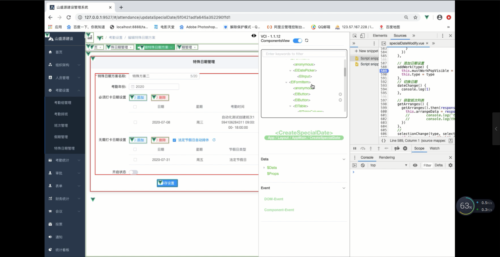
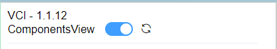
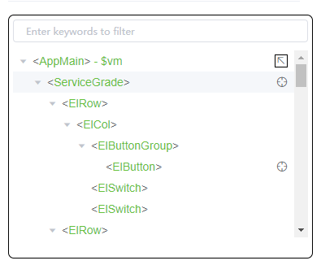
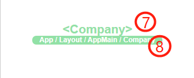
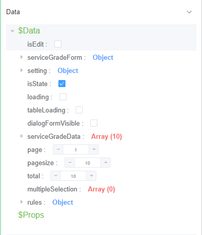
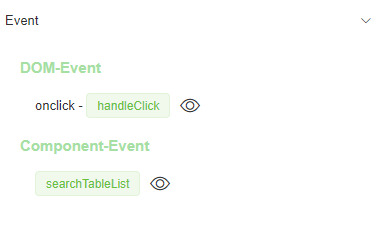

# Vue-Component-Inspector

> Vue-Component-Inspector 是一款 Vue 2.0 开发调试工具，它本身也是一个 Vue 组件。

基于 [Element-UI](https://element.faas.ele.me/#/zh-CN/component/installation) 开发。


## 安装方法 (Vue CLI )

```bash
$ npm install vue-component-inspector -S
```


####在 main.js 中写入以下内容：
```js
import VCI from 'vue-component-inspector'
 
Vue.use(VCI)
```

####在 app.vue 中写入以下内容：
```js
<div id="app">
    <vue-component-inspector/>
</div>
```


## 配置参数
```js
const options = {
  latencyThreshold: 200, // Number of ms before progressbar starts showing, default: 100,
  router: true, // Show progressbar when navigating routes, default: true
  http: false // Show progressbar when doing Vue.http, default: true
};
Vue.use(VCI, options)
```


## 使用教程

### 视频教程



视频地址


#### 视图栏


#### 导航面板



#### 基本信息面板



#### 数据面板



#### 事件面板


